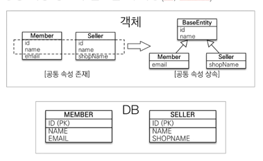

## @MappedSuperclass

- 공통 매핑 정보가 필요할 때
- 귀찮음을 줄이고자 사용
- 만약에 모든 테이블에 공통적으로 사용되는 정보가 있다면?
- 그리고 그걸 모든 엔티티에 넣기가 너무 귀찮다면?

- 상속관계 매핑이 아니다.
- 엔티티가 아니다. 테이블과 매핑 X
- 조회/검색 불가 
  - em.find(BaseEntity) XXXX
- 직접 생성해서 사용할 일이 없으므로 추상 클래스로 만들기를 권장한다.

- @MappedSuperclass
  - 테이블과 관계 X
  - 엔티티가 공통으로 사용하는 매핑 정보를 모으는 역할
  - 주로 등록일, 수정일, 등록자, 수정자 같은 공통 정보를 모을때 사용
