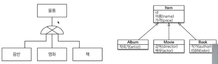
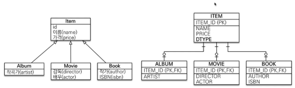
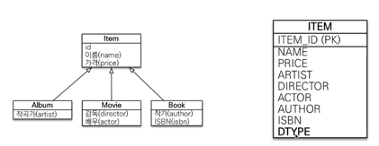
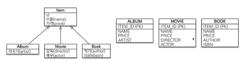
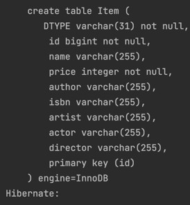
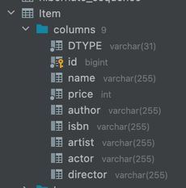
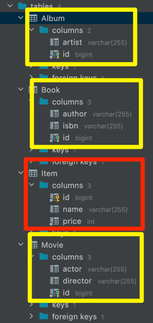
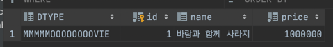

## 상속 관계 매핑

- 관계형 데이터베이스는 상속관계라는건 없다.
- 그나마 슈퍼-서브타입 관계라는 모델링 기법이 객체 상속과 유사하다.
- 상속관계 매핑이란
  - 객체 상속 구조 - DB의 슈퍼-서브타입 관계를 매핑

---


왼쪽이 DB 논리 모델, 오른쪽이 객체의 상속 관계

---

### 상속관계 매핑
- 객체는 어차피 상속관계를 지원하기 때문에 그대로 하면된다.
- DB에서 상속관계를 설계하는 방법은 세가지가 있다.

1. 조인 전략 (각각의 테이블로 변환하는 방법 : 정석!!!)

    - insert는 두번을 하고 조회는 pk, fk로 조인을 해서 가져온다.
    - ITEM 테이블에 구분을 위한 컬럼(DTYPE)을 둔다.
    - 가장 정규화된 방식 (JPA와도 가장 유사하다.)
    - 장점
      - 테이블이 정규화되어 있다.
      - FK를 활용 가능하다.
      - 저장공간을 활용할 수 있다.
    - 단점
      - 조회시 JOIN이 많이 사용되어 성능이 저하
      - 조회 쿼리가 복잡하다.
      - 데이터 저장시 INSERT 쿼리 2번 호출
    - 영한피셜
      - 인서트 쿼리가 두번 나가거나 조인하거나 이런건 크게 성능에 문제가 안된다.(단점이 아니라고 본다)
      - 이건 그냥 좀 복잡한게 단점이긴 함 ㅇㅇ
2. 단일 테이블 전략 (통합 테이블로 변환하는 방법)

    - 그냥 한테이블에 때려박기
    - pk 하나 두고 컬럼을 다 때려박자.
    - 구분을 위한 컬럼(DTYPE)을 둔다.
    - 장점
      - 조인이 필요없어 조회 성능이 빠르다.
      - 조회 쿼리가 단순함
    - 단점
      - 치명적 : 자식 엔티티가 매핑한 컬럼은 Nullable 해야한다.
        - 데이터 무결성 입장에서는 좀...
      - 테이블이 커질 수 있다.
      - 상황에 따라 조회 성능이 느려질 수 있다.
    - 영한피셜
      - 조회 성능이 느려지려면 어떤 임계점(테이블의 크기)을 넘어야 하는데 보통 이렇게 넘을 일은 거의 없다.
3. 구현 클래스마다 테이블 (서브타입 테이블로 변환하는 방법)

    - 공통 컬럼(name, price)을 ITEM 테이블에 두지 말고 각각 다 둔다.
    - 영한피셜
      - 결론부터 말씀드리면 쓰면 안되는 전략
      - ORM 세계는 객체지향을 좋아하는 사람과 DB를 좋아하는 사람의 트레이드오프가 존재한다.
      - 근데 이 방법은 둘다 추천하지 않는 전략
      - 정산을 하려고 할때만 봐도 생각을 해보자.
        - 자식 테이블을 통합해서 쿼리하기가 어렵다.
        - 여러 자식 테이블을 함께 조회할때 성능이 개구림
      - 변경 관점에서도 개구리다.
        - 시스템이 뭔가 새로운 타입이 추가될때 굉장히 많은 걸 고쳐야 한다.
<br><br>

---

### 직접 해보자

```java
@Entity
public class Item {
   @Id @GeneratedValue
   private Long id;

   private String name;
   private int price;
}

@Entity
public class Album extends Item{
    private String artist;
}
@Entity
public class Book extends Item{
   private String author;
   private String isbn;
}

@Entity
public class Movie extends Item{
   private String director;
   private String actor;
}
```
- 각자 엔티티를 선언해보니?





- 띠용? 한 테이블에 다들어간다. 
- 이러는 이유는 JPA의 기본 전략 자체가 싱글테이블(2번) 방식과 매핑이 되기 때문이다.

<br><br><br>

---

## 주요 어노테이션

1. `@Inheritance(strategy = InheritanceType.XXX)`
   - 원하는 전략으로 테이블을 만들 수 있다.
   1. `InteritanceType.JOINED` : 조인 전략
   2. `InteritanceType.SINGLE_TABLE` : 싱글 테이블 전략 (default)
   3. `TABLE_PER_CLASS` : 구현 클래스마다 테이블 전략
```java
@Entity
@Inheritance(strategy = InheritanceType.JOINED)
public class Item {
   @Id @GeneratedValue
   private Long id;
}
```


<br>

2. `@DiscriminatorColumn`
   - 구분할 수 있는 컬럼이 만들어진다. (DTYPE)
   - 싱글테이블 전략에서는 꼭 들어가줘야 한다.
```java
@Entity
@Inheritance(strategy = InheritanceType.JOINED)
@DiscriminatorColumn
public class Item {
   @Id @GeneratedValue
   private Long id;
}
```
```sql
 create table Item (
    DTYPE varchar(31) not null,
    id bigint not null,
    name varchar(255),
    price integer not null,
    primary key (id)
 ) engine=InnoDB
```

<br>

3. @DiscriminatorValue("my_value")
   - 상위 클래스에서 자신을 어떻게 저장할지 이름을 정할 수 있다.
   - 하위 클래스에서 자신을 지정해야 함
   - default : entity name (Movie, Book, Album)
```java
@Entity
@DiscriminatorValue("MMMMMOOOOOOOOVIE")
public class Movie extends Item { 
    
}
```

 

