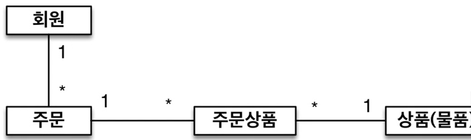
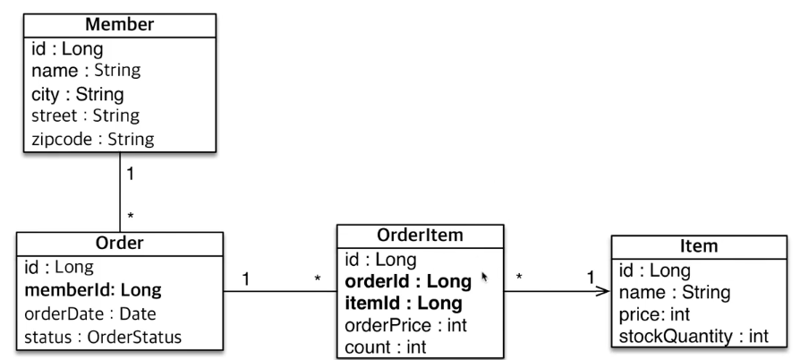

## 요구사항 분석

---

### 요구사항

1. 회원은 상품을 주문할 수 있다.
2. 주문시 여러 상품을 선택할 수 있다.

---

### 기능 목록

1. 회원 기능
   1. 회원 등록
   2. 회원 조회
2. 상품 기능
   1. 상품 등록
   2. 상품 수정
   3. 상품 조회
3. 주문 기능
   1. 상품 주문
   2. 주문 내역 조회
   3. 주문 취소

--- 

### 도메인 모델 분석
1. 회원 & 주문 
   1. 회원은 여러번 주문할 수 있다.
2. 주문 & 상품
   1. 주문 한번에 여러 상품을 선택할 수 있다.
   2. 하나의 상품은 여러번 주문될 수 있다.

---

### 테이블

---

### 문제점

- 현재 방식은 객체 설계를 테이블에 맞춘 방식이다.
- 테이블의 외래키를 객체에 그대로 가져온 방식
- 객체의 그래프 탐색이 불가능

