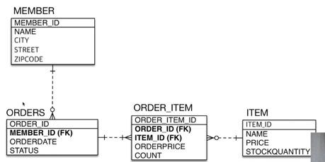
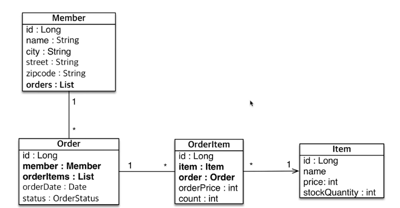

### 이전 테이블 구조

 

### 이전 객체 구조

 

`단방향 연관관계를 매핑하는게 가장 중요하다.`
`연관관계의 주인은 fk를 가지고 있는 놈이 주인이다.`

1. `Member - Orders` : Orders의 memberNo가 주인
2. `Orders - Order_Item` : OrderItem의 orderNo가 주인
3. `OrderItems - Item` : OrderItem의 ItemNo가 주인
