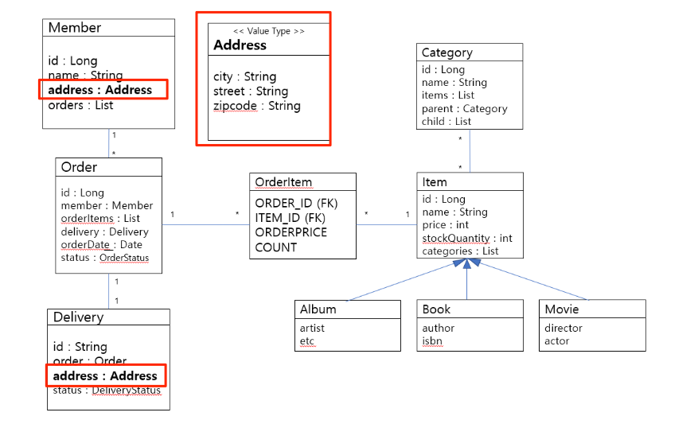

## city, street, zipcode 는 Address 값 타입으로 변경

1. 값 타입 클래스 추가 - Address.java
2. @Embeddable 어노테이션 추가
3. 불변 객체로 생성 
   - 필드(맴버 변수) 추가 
   - getter 추가 
   - setter private로 생성 또는 생성 X
   
   - 값 타입은 공유해서 사용시 변경이 되면 같이 사용하는 값 모두 변경되므로 주의
   - 값 타입은 변경하지 말고 객체를 새로 생성해서 갈아껴야함. (.equals()와 hashcode() 오버라이딩)
   - == 비교에서 값 전체 비교로 변경
4. 값 타입을 사용(Embedded)할 엔티티에 생성한 값 타입 추가

