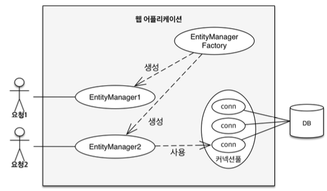
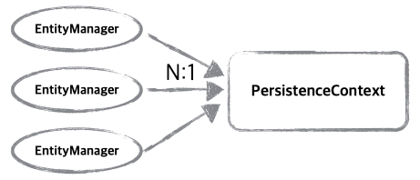
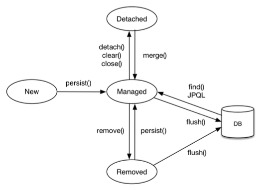

## 영속성 컨텍스트
#### 엔티티를 저장하는 환경

---

- 영속성 컨텍스트는 논리적 개념
- EntityManager를 통해 영속성 컨텍스트에 접근


- 요청마다 EntityManagerFactory에서 EntityManager를 생성
- em이 내부적으로 DB connection을 사용

<br>

`emp.persist(member) 는 디비에 저장하는게 아니고 영속성 컨텍스트에 저장하는 것이다??`


<br>



<br>

---

### 엔티티의 생명주기


<br>

---


### 엔티티의 상태

<br>

#### 비영속 (객체를 생성한 상태)

```java
Member member = new Member();
member.setId(1L);
member.setUserName("형준혁");
```
- JPA에 전혀 관계 없음

<br>

#### 영속

```java
Member member = new Member();
member.setId(1L);
member.setUserName("형준혁"); 

EntityManager em = emf.createEntityManager();
em.getTransaction().begin();

em.persist(member); // 여기서부터 영속 상태가 된다.
```
- entityManager 안의 영속성 컨텍스트에 member가  들어가면서 영속 상태가 된다.

<br>

#### 준영속 상태
```java
// 엔티티를 영속성 컨텍스트에서 분리한 상태
em.detach(member);
```

<br>

#### 삭제
```java
// 객체를 삭제한 상태
em.remove(member);
```

<br>

---

### 영속성 컨텍스트의 이점

- 1차 캐시
- 동일성 보장
- 트랜잭션을 지원하는 쓰기 지연
- 변경 감지
- 지연 로딩


