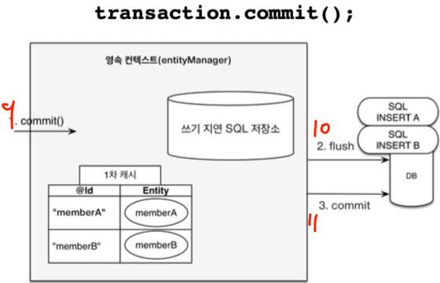

## 영속성 컨텍스트의 이점

### 1. 1차 캐시
- 영속성 컨텍스트에는 1차 캐시가 존재한다.
- `@Id`로 매핑한 컬럼이 key, `Entity`가 value가 된다.

```java
// 1차 캐시에 저장됨
em.persist(member1);
// 1차 캐시에서 먼저 조회
em.find(Member.class, "member1"); 


// 1차 캐시에 존재하지 않으므로 DB에서 조회 + 캐시에 저장 + 반환
em.find(Member.class, "member2");
// 위에서 캐시에 저장헀으므로 DB SELECT 쿼리 x
em.find(Member.class, "member2"); 
```


<br>

--- 

### 2. 동일성 보장
- 영속 엔티티간 동일성을 보장해준다.
- 1차 캐시로 REPEATABLE READ등급의 트랜잭션 격리 수준을 DB가 아닌 Application 차원에서 제공해준다.
```java
Member member1 = em.find(Member.class, "member1");
Member member2 = em.find(Member.class, "member1");

System.out.println(member1 == member2); // true
```


<br>

--- 
### 3. 트랜잭션을 지원하는 쓰기 지연
- 트랜잭션이 끝나기 전까지 INSERT SQL을 보내지 않는다.

```java
em.persist(member1);
em.persist(member2);

// 이 때 member1, member2를 DB에 저장
transaction.commit();
```




<br>

--- 


### 4. 변경 감지 (dirty checking)
- JPA는 변경 감지 기능이 존재
- entity의 값을 바꾸려면 set으로 값을 바꾸고 `em.update(member)` 같은걸 해야하지 않을까??
- 안해도 된다.

```java
Member member = em.find(Member.class, 1L);
member.setName("ZZZZZ");

// 이런거 안해도 update 된다.
// em.persist(member);
```


<br>

--- 

### 5. 엔티티 삭제
```java
Member member = em.find(Member.class, 1L);
em.remove(member);
```

<br>
---
