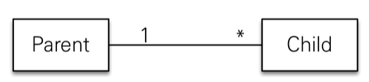
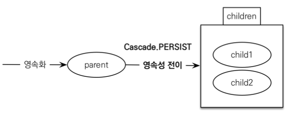

# 영속성 전이 : CASCADE

- 엔티티(A)를 영속 상태로 만들 때 연관된 엔티티(B)도 함께 영속 상태로 만들고 싶을 때
- ex) 부모 엔티티를 저장할 때 자식 엔티티도 함께 저장.
- 영속성 전이는 `연관관계를 매핑하는 것과 아무 관련이 없음`
- 연관된 엔티티도 함께 영속화하는 편리함을 제공할 뿐



```java
@OneToMany(mappedBy="parent", cascade=CascadeType.PERSIST)
```



<br>

---

### CASCADE 종류

1. ALL: 모두 적용 : 
2. PERSIST: 영속 
   - 삭제하면 안될 때
3. REMOVE: 삭제
4. MERGE: 병합
5. REFRESH: REFRESH 
6. DETACH: DETACH

<br>

`단 하나의 부모가 자식들을 관리하는 상황에 사용하자`
`child가 다른 연관관계가 있으면 쓰지 말자`

---

### 고아 객체

- 고아 객체 제거
  - 부모 엔티티와 연관관계가 끊어진 자식 엔티티 를 자동으로 삭제
- `orphanRemoval = true`

```java
Parent parent1 = em.find(Parent.class, id);
parent1.getChildren().remove(0);
```

- 자식 엔티티를 컬렉션에서 제거
- DELETE FROM CHILD WHERE ID=?
- 참조가 제거된 엔티티는 다른 곳에서 참조하지 않는 고아 객체로
- 보고 삭제하는 기능
- `참조하는 곳이 하나일 때 사용해야함!` : cascade와 동일
  - 특정 엔티티가 개인 소유할 때 사용
  - `@OneToOne`, `@OneToMany`만 가능
  - 참고: 개념적으로 부모를 제거하면 자식은 고아가 된다. 
  따라서 고아 객체 제거 기능을 활성화 하면, 부모를 제거할 때 자식도 함께 제거된다. 이것은 `CascadeType.REMOVE`처럼 동작한다.

<br>

---

### 영속성 전이 + 고아 객체, 생명주기

- `CascadeType.ALL` + `orphanRemovel=true`
- 기존 : 스스로 생명주기를 관리하는 엔티티는 `em.persist()`로 영속화, `em.remove()`로 제거
- 둘 다 활성화 하면 : 두 옵션을 모두 활성화 하면 부모 엔티티를 통해서 자식의 생명 주기를 관리할 수 있음 
- 도메인 주도 설계(DDD)의 `Aggregate Root`개념을 구현할 때 유용
  - repository는 `Aggregate Root`만 컨텍하고 나머지는 repo를 만들지 않는다?
  - `Aggregate Root`를 통해 생명주기를 관리
  - `Aggregate Root` : parent
