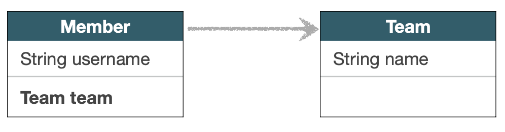
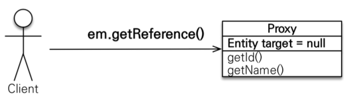
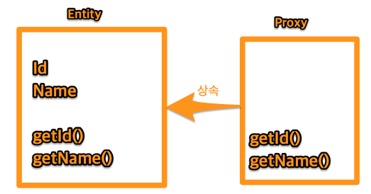
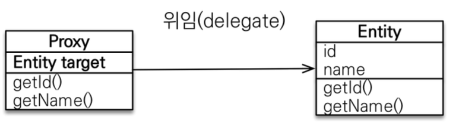
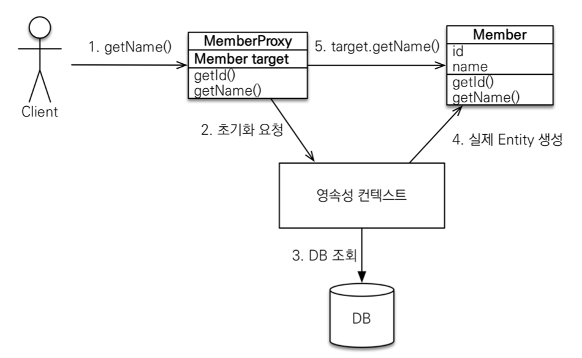

## 프록시

### Member를 조회할 때 Team도 같이 조회해야 하는가?



1. 함께 조회할 것이다.
```java

public void printUserAndTeam(String memberId) {
    Member member = em.find(Member.class, memberId);
    Team team = member.getTeam();

    System.out.println("회원 이름: " + member.getUsername()); 
    System.out.println("소속팀: " + team.getName());
}
```

2. Member만 조회할 것이다.
```java
public void printUser(String memberId) {
    Member member = em.find(Member.class, memberId);
    System.out.println("회원 이름: " + member.getUsername());
}
```

- 어느 경우에는 Member만, 어느 경우에는 Member&Team 둘다 가져오고 싶을 때가 있다.
- Member만 조회하고 싶을 때 이 상황은 낭비이다.
- JPA는 이를 `지연로딩`과 `프록시`로 기가 막히게 해결한다.

---

### 프록시 BASE

- em.find() vs em.getReference()
  - em.find()
    - 데이터베이스를 통해서 실제 엔티티 객체 조회
  - em.getReference()
    - 데이터베이스 `조회를 미루는 가짜(프록시) 엔티티 객체` 조회
    - 결론적으로 디비에 쿼리가 나가지 않는데 `객체 조회`가 가능하다???!! (`proxyMain`)



- em.gerReference()
  - hibernate 가 내부의 라이브러리를 통해 Proxy라고 하는 가짜 엔티티 객체를 준다.
  - 껍데기는 똑같은데 내부가 텅텅 비었다.
  - Entity target : 이게 진짜

---

### 프록시 객체의 특징

- 클래스를 상속 받아서 만들어짐 (by hibernate)
- 실제 클래스와 `겉` 모양이 같다.
- 사용하는 입장에서는 진짜 객체인지 프록시 객체인지 구분하지 않고 사용하면 됨 (이론상)
  - 몇 가지 조심해야 할 건 있다.



- 프록시 객체는 실제 객체의 참조(target)를 보관한다.
- 프록시 객체를 호출하면 프록시 객체는 실제 객체의 메소드 호출




---

### 프록시 객체의 초기화

```java
Member member = em.getReference(Member.class, “id1”);
member.getName();
```

### 진짜 엔티티를 반환하는 과정



- 프록시가 만약 빈 객체라면 해당 데이터를 초기화하도록 요청한다.
- 2번 / 3번이 제일 중요

---

<br>

### 정리

- 프록시 객체는 처음 사용할 때 한번만 초기화 
- 프록시 객체를 초기화 할 때, 프록시 객체가 실제 엔티티로 바뀌는 것은 아님, 초기화되면 프록시 객체를 통해서 실제 엔티티에 접근 가능 (중요 : 프록시 객체는 그대로 프록시 객체긴 하다. 타겟에만 값이 채워짐)
- 프록시 객체는 원본 엔티티를 상속받음, 따라서 타입 체크시 주의해야함 (== 비 교 실패, 대신 instance of 사용)
- 영속성 컨텍스트에 찾는 엔티티가 이미 있으면 em.getReference()를 호출해 도 실제 엔티티 반환 (중요)
- 영속성 컨텍스트의 도움을 받을 수 없는 준영속 상태일 때, 프록시를 초기화하면 문제 발생
  (하이버네이트는 org.hibernate.LazyInitializationException 예외를 터트림)

---
