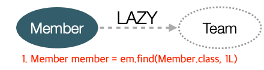
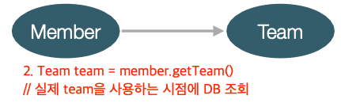
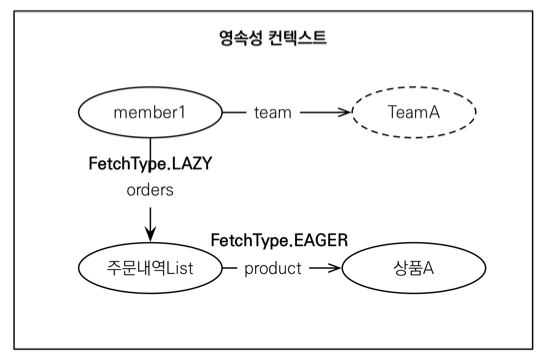

### Member를 조회할 때 Team도 함께 조회해야 할까?


단순히 member 정보만 사용하는 비즈니스 로직
println(member.getName());


<br>

---

## 지연 로딩 LAZY를 사용해서 프록시로 조회
- 연관된 객체를 `프록시 객체`로 가져온다!
  - 그 말인 즉, 사용 전까지는 DB에 조회를 하지 않는다는 것 

```java
@Entity
public class Member {
    @Id @GeneratedValue
    private String name;

    @Column(name = "USERNAME")
    private String name;
    
    @ManyToOne(fetch = FetchType.LAZY)
    @JoinColumn(name = "TEAM_ID")
    private Team team;
}
```




<br>

---


## 즉시 로딩 EAGER를 사용해서 함께 조회
- Member, Team을 자주 함께 사용한다면

```java
@Entity
public class Member {
    @Id @GeneratedValue
    private Long id;

    @Column(name = "USERNAME")
    private String name;
    
    @ManyToOne(fetch = FetchType.EAGER) 
    @JoinColumn(name = "TEAM_ID")
    private Team team;
}
```


<br>

---

## 주의

- 모든 연관관계에 지연로딩을 사용해라! (실무에서 즉시 로딩하지 마셈)
- 즉시 로딩의 문제점
  - 예상하지 못한 SQL이 발생
    - `Member`만 가져오는데 `Team`이 1+1? 
  - JPQL에서 N+1 문제를 일으킨다.
- @ManyToOne, @OneToOne은 기본이 즉시 로딩 
  - LAZY로 설정하라
- @OneToMany, @ManyToMany는 기본이 지연 로딩
- JPQL fetch 조인 or 엔티티 그래프 기능을 사용하자 (설명은 이후에)

<br>

---

### LAZY LOADING 활용

- 이건 이론이고 실무에서는 다 지연 로딩 써라
- Member와 Team은 자주 함께 사용 -> 즉시 로딩 
- Order와 Product는 자주 함께 사용 -> 즉시 로딩
- Member와 Order는 가끔 사용 -> 지연 로딩


