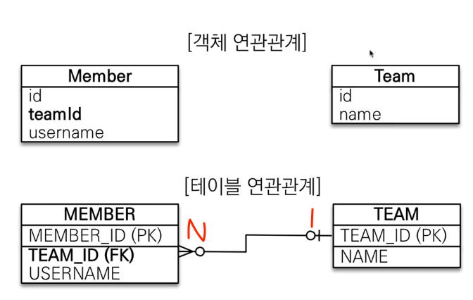
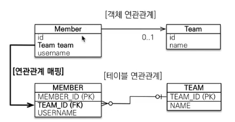

### 목표

- 객체와 테이블 연관관계의 차이를 이해하자
    - 객체의 참조와 테이블의 외래키를 매핑해보자
- 용어
  - 방향 : 단방향, 양방향
  - 다중성 : 1:1, 1:N, N:1, N:M
  - 연관관계의 주인(Owner)
    - 객체 양방향 연관관계는 관리 주인이 필요하다.
    - JPA계의 포인터 ㅠ

---

### 연관관계가 필요한 이유

`객체지향 설계의 목표는 자율적인 객체들의 협력 공동체를 만드는 것이다.`

##### 예제 시나리오
1. 회원과 팀 존재
2. 회원은 하나의 팀에만 소속될 수 있다.
3. 회원:팀 = N:1

---
#### 객체를 테이블에 맞춰 모델링하면?



```java
@Entity
public class Member {
    @Id @GeneratedValue 
    private Long id;
    
    private String userName;
    
    private Long teamId;
}
```

```java
@Entity
public class Team {
    @Id @GeneratedValue 
    private Long id;
    
    private String name;
}
```

```java
// 등록
Team team = new Team();
team.setName("TeamA");
em.persist(team);

Member member = new Member();
member.setUserName("member1");
member.setTeamId(team.getId());
em.persist(member);
```

```java
// 조회
Member member = em.find(Member.class, 1L);
Long teamId = member.getTeamId();
Team team = em.find(Team.class, teamId);
```

---

### 문제점

- 객체를 테이블에 맞추어 모델링 하면??
  - 협력 관계를 만들 수 없다.
    - 테이블은 외래키로 조인을 해서 연관된 테이블을 찾는다.
    - 객체는 참조를 사용해서 연관된 객체를 찾는다.

<br><br><br>

---

### 객체지향 모델링

```java
@Entity
public class Member {

  // JPA 에게 둘의 관계를 알려줘야 한다.
  // member 입장에서 Many, team 입장에서 One
  @ManyToOne
  // join 해야하는 컬럼 명시
  @JoinColumn(name = "teamNo")
  private Team team;
}
```


<br><br>

----

