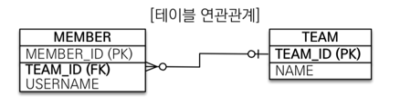
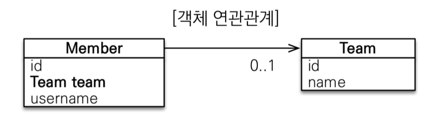
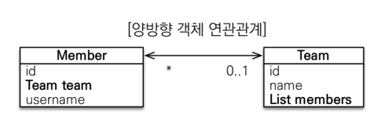
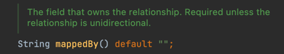
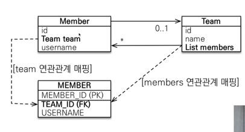

### 양방향 연관관계와 연관관계의 주인 

- 테이블

  - 단방향 연관관계
  

  - 양방향 연관관계
  

---

### 테이블 연관관계에는 변함이 없다.
 - Member가 속한 Team을 알고 싶을 때,
   - 각 team_id 로 join
 - Team에 소속된 Member들을 알고 싶을 때,
   - team_id로 join (동일)
 - 테이블에서는 `외래키` 하나로 연관관계가 이루어진다.
 - 문제는 객체
   - 단방향 연관관계에서는 Member에서 Team으로 갈 수 있는 방법이 없다.
   - Team에서 Member로 갈 수 있는 방법이 없다.


---

### `mappedBy` 
- 
- 관계를 소유하는 필드입니다. 관계가 단방향인 경우가 아니면 필수입니다.
- 관계의 주인이라는 뜻?

<br>

--- 
### 객체와 테이블이 관계를 맺는 차이
- 테이블은 연관관계가 1개이다.
  - 외래키 하나로 두 테이블의 연관관계를 관리
  - Member의 TeamNo(FK)
  - 외래키 하나로 양쪽으로 조인이 가능하다.
```sql
SELECT *
FROM member m
JOIN team t on m.teamNo = t.teamNo;

SELECT *
FROM team t
JOIN member m on t.teamNo = m.teamNO;
```

<br>

- 객체는 연관관계가 2개이다.
  - Member->Team + Team->Member 
  - 단방향 연관관계가 두개 있는것 뿐이다.
  - 객체를 양방향으로 참조하려면 단방향 연관관계를 2개 만들어야 한다.

```java
class A {
    B b; // A->B : a.getB()
}
class B {
    A a; // B->A : b.getA()
}
```

<br><br>

---
### 딜레마


- 객체를 양방향으로 만들어놓은 상태(참조가 2개)
- `Member 테이블의 Team_id 를 변경하고 싶을 때 뭐를 수정해야 할까?`
  1. Member 객체의 Team 을 수정한다?
  2. Team 객체의 List<Member> 을 수정한다?
  - db 입장에서는 객체의 참조가 어떻게 됐든 team_id만 업데이트가 잘 되면 된다.
  - 단방향일땐 Member의 team만 건드리면 됐는데 지금은 좀 혼란스럽다...

- `연관관계의 주인 RULE : 둘 중 하나로 외래키를 관리해야 한다`

---
<br>

### 연관관계의 주인
- 양방향 매핑의 RULE
  1. 객체의 두 관계중 하나를 연관관계의 주인으로 지정
     1. `Member의 Team` or  `Team의 List<Member>` 둘중 하나가 주인이 되어야 한다.
  2. 주인만이 외래키를 관리할 수 있다.(등록, 수정)
  3. 주인이 아닌 쪽은 `read only`
  4. 주인은 mappedBy(x), 하인은 mappedBy(o)
     1. 주인이 아니면 mappedBy로 주인을 지정해주는 것

<br>

- `주인을 누구로 해야하지??`
  - 외래키가 있는 곳을 주인으로 하자 (영한 가이드)
  - `Member.team` : 진짜 매핑(연관관계의 주인)
  - `Team.members` : 가짜 매핑(하인)

<br><br>

---

### 영한피셜
- 양방향 매핑이 과연 좋냐에 대해서는 사실 객체는 가급적이면 단방향이 좋다. 양방향으로 하면 신경쓸게 너무 많다.
