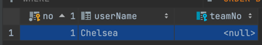

### 양방향 매핑시 가장 많이 하는 실수

---

### 연관관계 주인에 값을 입력하지 않음

```java
Member member = new Member();
member.setUserName("Kante");
em.persist(member);

Team team = Team.create("Chelsea");
team.getMembers().add(member);
em.persist(team);
```


- 연관관계의 주인이 Member의 `Team`이다.
- Team의 `List<Member>`는 read only라서 값을 넣어봤자 의미 없음~
- 연관관계에 주인에만 값을 세팅하자 ok, 근데 양방향 매핑에서는 가급적이면 둘다 값을 넣어주자.
  - jpa 입장에서는 연관관계 주인에 값을 넣어주는게 맞다.
  - 객체지향적으로 생각해보면 양쪽에 값을 걸어주는게 맞다.

<br>

---

### 양방향 매핑에서 양쪽에 값을 넣어주어야 하는 이유

```java
Team team = Team.create("Chelsea");
em.persist(team);

Member member = Member.create(team, "kante");
em.persist(member);

Team t = em.find(Team.class, team.getTeamNo());
List<Member> members = t.getMembers();  // size = 0
```

- 그러지 않았을 때의 문제
  1. `flush()`, `clear()`를 안했을 때 가짜 매핑 안먹음
     - 1차 캐시에 집어넣은 상태 그대로 들어가있다.
     - `List<Member>` 에 값이 안들어간다.
     - 1차 캐시에 로딩되어있는 순수한 객체상태를 가져오게 되니 리스트에 값이 들어가 있을리가?
  2. testCase 작성시
      - 보통 jpa 없이 순수 자바 코드로 테스트한다.
      - member.getTeam()은 되는데 team.getMembers()는 empty인 경우가 생긴다.

```java
member.setTeam(team) // 1번
team.getMembers().add(member) // 2번

// 2번 코드를 member.setTeam() 함수에 넣는걸 권장
```

`결론 : 양방향 연관관계에서는 값을 두 관계에 전부 넣어주자.`


<br>

---

### 양방향 매핑시 무한루프를 조심하자

- ex) toString(), lombok, JSON
- member에서 team.toString() + team에서 members.toString() 
- == 무한루프

<br>
<br>
<br>
<br>
<br>

---

## 정리

### 영한 피셜

`설계 입장에서 보면 단방향 매핑만으로 설계가 끝나야 한다!`

```
jpa 모델링하실때 단방향 매핑으로 처음에 설계를 끝내야 해요.
실무에 보면 테이블이 수십개가 있다. 
테이블 설계와 객체 설계가 같이 되어야 하는데 그 시점에 테이블 관계에서의 대략적인 외래키가 다 나온다.
Many쪽에 단방향 매핑으로 들어가야 하는데, 이때 양방향 매핑 하지마라.

양방향 매핑은 반대방향으로 조회 기능이 추가되는 것 뿐이다.
처음부터 만들어놓지 말고 나중에 조회가 필요하면 추가하면 되는거야. 
(테이블이랑 관련없이 그냥 객체 그래프 탐색용)
```

