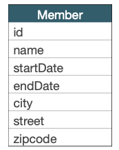
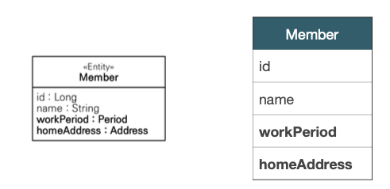
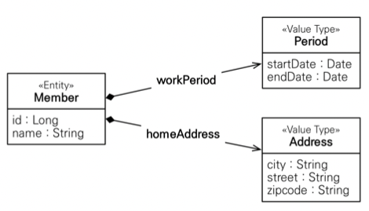
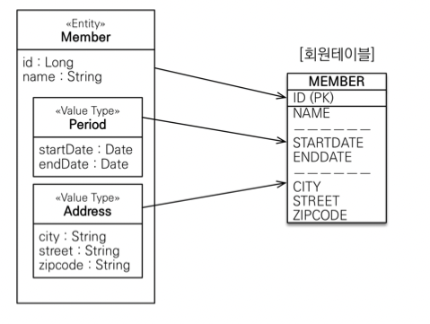
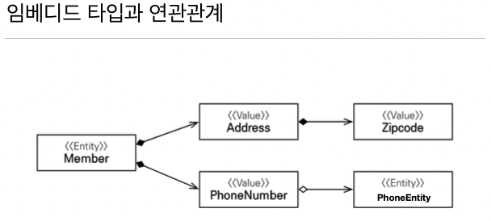

## 임베디드 타입

- 새로운 값 타입을 직접 정의할 수 있음
- JPA는 임베디드 타입(embedded type)이라 함
- 주로 기본 값 타입을 모아서 만들어서 복합 값 타입이라고도 함 
- int, String 과 같은 값 타입

 

- ex) 회원 엔티티는 이름, 근무 시작일, 근무 종료일, 주소 도시, 주소 번지, 주소 우편번호를 가진다.
  

 

- ex) 회원 엔티티는 이름, 근무 기간, 집 주소를 가진다.

 

 

---

## 임베디드 타입 사용법
- @Embeddable: 값 타입을 정의하는 곳에 표시
- @Embedded: 값 타입을 사용하는 곳에 표시
- 기본 생성자 필수

 

---

## 임베디드 타입의 장점
- 재사용성
- 높은 응집도
- Period.isWork()처럼 해당 값 타입만 사용하는 의미 있는 메소드를 만들 수 있음
- 임베디드 타입을 포함한 모든 값 타입은, 값 타입을 소유한 엔티 티에 생명주기를 의존함

 

---

## 임베디드 타입과 테이블 매핑
- 임베디드 타입은 엔티티의 값일 뿐이다.
- 임베디드 타입을 사용하기 전과 후에 매핑하는 테이블은 `같다`
- 객체와 테이블을 아주 세밀하게(find-grained) 매핑하는 것이 가능
- 잘 설계한 ORM 애플리케이션은 매핑한 테이블의 수보다 클래 스의 수가 더 많음
- 임베디드 타입의 값이 null : 매핑한 컬럼 값은 모두 null

 

---

 

---

## @AttributeOverride: 속성 재정의
- 한 엔티티에서 같은 값을 사용하면?
- 컬럼 명이 중복됨
- @AttributeOverrides, @AttributeOverride를 사용해서 컬러 명 속성을 재정의

---
