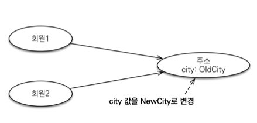
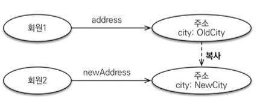

## 값 타입과 불변 객체

## `값 타입은 복잡한 객체 세상을 조금이라도 단순화하려고 만든 개념이다. 따라서 값 타입은 단순하고 안전하게 다룰 수 있어야 한다.`

---

### 값 타입을 공유?
- 임베디드 타입 같은 값 타입을 여러 엔티티에서 공유하면 위험하다.
- 부작용 발생 가능 


- 두 회원이 같은 주소를 바라보고 있으면?
- 주소가 변경되면 두 회원의 주소가 모두 변경된다.

```java
Address address = new Address("city");

Member member1 = new Member();
member1.setAddress(address);
em.persist(member1)

Member member2 = new Member();
member2.setAddress(address);
em.persist(member2)

// 이러면 두개 다 바뀐다;
// 노렸다고 할 수 있지만 진짜 노릴거면 Address를 엔티티로 만들어서 사용하셈
member1.getHomeAddress.setCity("newCity");
```
<br>

---

### 값 타입 복사해서 사용하자
- 값 타입의 실제 인스턴스인 값을 공유하면 위험하다.
- 대신 값(인스턴스)를 복사해서 사용




```java
Address address = new Address("city");

Member member1 = new Member();
member1.setAddress(address);
em.persist(member1)
    
address = new Address("city")
Member member2 = new Member();
// 다른 객체가 들어가게 해야 한다.
member2.setAddress(address);
em.persist(member2)

member1.getHomeAddress.setCity("newCity");
```

<br>

---

## 객체 타입의 한계
- 항상 값을 복사해서 사용하면 공유 참조로 인해 발생하는 부작용 을 피할 수 있다.
- 문제는 임베디드 타입처럼 직접 정의한 값 타입은 자바의 기본 타입이 아니라 객체 타입이다.
- 자바 기본 타입에 값을 대입하면 값을 복사한다.
- 객체 타입은 참조 값을 직접 대입하는 것을 막을 방법이 없다. (컴파일 단계에서 막을 방법이 없음 ㅠ)
- 객체의 공유 참조는 `피할 수 없다.`
- 타입만 맞으면 다들어가는데 어떻게 막을거임 ㅠㅠ

<br>

기본 타입 (primitive type)

```java
int a = 10;
int b = a; //기본 타입은 값을 복사 
b = 4;
```

<br>

객체 타입

```java
Address a = new Address(“Old”);
Address b = a; //객체 타입은 참조를 전달
b.setCity(“New”);
```

<br>

---

## 불변 객체
- 객체 타입을 수정할 수 없게 만들면 부작용을 원천 차단할 수 있다.
- 값 타입은 `불변 객체(immutable object)로 설계`해야함
- 불변 객체: 생성 시점 이후 절대 값을 변경할 수 없는 객체
- 생성자로만 값을 설정하고 수정자(Setter)를 만들지 않으면 됨 •
- 참고: Integer, String은 자바가 제공하는 대표적인 불변 객체

### `불변이라는 작은 제약으로 부작용이라는 큰 재앙을 막을 수 있다.`


---
