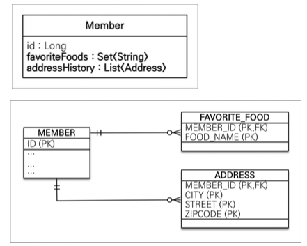
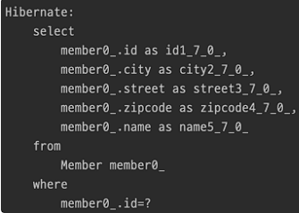

## 값 타입 컬렉션



- 값 타입을 하나 이상 저장할 때 사용
- 위의 `favoriteFoods`와 `addressHistory`는 컬렉션 타입이다. (각각 `set`과 `list`)
- 데이터베이스는 컬렉션을 같은 테이블에 저장할 수 없다.
- 컬렉션을 저장하기 위한 별도의 테이블이 필요함
    - 별도의 식별자 없이 소속된 테이블의 외래키와 값을 조합해 그걸 pk로 쓰자.
    - 이유 : pk를 따로 만들면 값타입이 아니라 엔티티이기 때문

<br>

---

### `@ElementCollection`, `@CollectionTable` 사용

```java

@Entity
public class Member {
    ...

    @Embedded
    private Address homeAddress;

    // 컬렉션으로 이루어진 값 타입에 달아주자
    @ElementCollection
    @CollectionTable(
            name = "FAVORITE_FOOD", // 테이블명
            joinColumns = @JoinColumn(name = "MEMBER_ID") // 외래키 명시
    )
    @Column(name = "FOOD_NAME")
    private Set<String> favoriteFoods = new HashSet<>();

    @ElementCollection
    @CollectionTable(name = "ADDRESS", joinColumns = @JoinColumn(name = "MEMBER_ID"))
    private List<Address> addressHistory = new ArrayList<>();
}
```

<br>

---

## 값 타입 컬렉션 사용


### 값 타입 컬렉션 저장

```java
Member member = new Member();
member.setUsername("형준혁");
member.setHomeAddress(new Address("죽전", "죽전로", "123"));

// 값 타입 컬렉션
member.getFavoriteFoods().add("치킨");
member.getFavoriteFoods().add("피자");
member.getFavoriteFoods().add("햄버거");

member.getAddressHistory().add(new Address("용인", "용인로", "456"));
member.getAddressHistory().add(new Address("경기도", "경기도로", "789"));

em.persist(member);
```

- 값 타입 컬렉션을 따로 영속화(`persist`)하지 않아도 된다.
- `member`에 의존하기 때문에 `member`가 변경되면 같이 변경된다.
  - `member`와 라이프사이클을 같이 함
- 즉? `CascadeType.ALL` + `orphanRemoval = true`

<br>

---

### 값 타입 컬렉션 조회
```java
Member member = new Member();
member.setUsername("형준혁");
member.setHomeAddress(new Address("죽전", "죽전로", "87"));

// 값 타입 컬렉션
member.getFavoriteFoods().add("치킨");
member.getFavoriteFoods().add("피자");
member.getFavoriteFoods().add("햄버거");

member.getAddressHistory().add(new Address("용인", "용인로", "456"));
member.getAddressHistory().add(new Address("경기도", "경기도로", "789"));

em.persist(member);

em.flush();
em.clear();

// member를 다시 조회
Member findMember = em.find(Member.class, member.getId());
```



- member 조회시 값 타입 컬렉션은 조회되지 않는다.
  - 즉? `LAZY LOADING`!
  - embedded 타입인 address는 당연히 같이 조회된다.
- 나중에 `favoriteFoods`나 `addressHistory`를 실제 사용할 때 디비에서 꺼내온다.

<br><br>

---

### 값 타입 수정

```java
// 다 저장되어있는 상태
... 
Member findMember = em.find(Member.class, member.getId());

// embedded 타입은 불변해야 하므로 이렇게 변경하지 말자
// findMember.getHomeAddress().setCity("new city");

// 새로운 address 객체를 만들어서 집어넣어라 
Address prev = findMember.getHomeAddress();
findMember.setHomeAddress(new Address("구로", prev.getStreet(), prev.getZipcode()));

// 컬렉션 값 타입도 마찬가지로 불변해야 하므로 통째로 갈아끼운다.
findMember.getFavoriteFoods().remove("치킨");
findMember.getFavoriteFoods().add("당당치킨");

tx.commit();
```

- 컬렉션 값만 변경해도 JPA가 알아서 값 변경해줌
  - 마치 영속성 전이가 된것처럼 동작하는데
  - 이것은 `member`로 라이프사이클이 관리되는 member의 단순한 `속성`에 불과하기 때문
- 값 타입 컬렉션을 수정하고 싶으면
  - 1)찾아라! 2)지워라! 3)새로넣어라!
- 컬렉션에서 값을 찾을 때
  - equals()를 오버라이딩해서 찾자
  - 이유? equals()는 객체가 똑같아야 true, 객체의 값이 똑같은지 찾으려면 오버라이딩해야 함

<br>

---

### 값 타입 컬렉션의 제약사항

- 값 타입은 엔티티와 다르게 식별자 개념이 없다. (없어야 함)
- 값은 변경하면 추적이 어렵다.
- 값 타입 컬렉션에 변경 사항이 발생하면, 주인 엔티티와 연관된 모든 데이터를 삭제하고, <br> 값 타입 컬렉션에 있는 현재 값을 모두 다시 저장한다.
- 값 타입 컬렉션을 매핑하는 테이블은 모든 컬럼을 묶어서 기본 키를 구성해야 함
    - null 입력X, 중복 저장X

<br>

---

### 값 타입 컬렉션의 대안

- 영한피셜 : 실무에서는 그냥 일대다 씀
- 실무에서는 상황에 따라 값 타입 컬렉션 대신에 일대다 관계를 고려
- 일대다 관계를 위한 엔티티를 만들고, 여기에서 값 타입을 사용
  - ex) 위의 경우에 `AddressEntity`를 만들고 1(`Member`) : N(`AddressEntity`)으로 쓰자
  - ```java
    // 영속성 전이(Cascade) + 고아 객체 제거를 사용해서 값 타입 컬렉션 처럼 사용
    @OneToMany(cascade = ALL, orphanRemoval = true)
    @JoinColumn(name = "MEMBER_ID")
    private List<AddressEntity> addressHistory = new ArrayList<>();
  ```
  
---

### `값 타입은 정말 값 타입이라 판단될 때만 사용`

### `엔티티와 값 타입을 혼동해서 엔티티를 값 타입으로 만들면 안됨`

### `식별자가 필요하고, 지속해서 값을 추적, 변경해야 한다면 그것은 값 타입이 아닌 엔티티`
