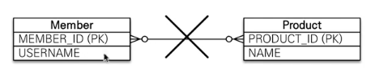
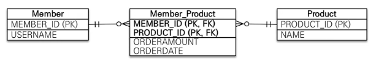

# 다대다 [N:M]

김영한(일타강사) : 여러분들 좋은소식은 이번에는 좀 편하게 들으시면 됩니다. <br>
김영한(일타강사) : 이전까진 중요했는데... 결론부터 말씀드리면 실무에서 쓰면 안된다고 봅니다. <br>


끝!!!
<br>
<br><br><br><br><br><br><br><br><br><br><br>
<br><br><br><br><br><br><br><br><br><br><br>

????
<br><br><br><br><br><br><br><br><br><br><br>

---

### 쓰면 안되는 이유라도 알아보자
- RDB는 테이블 두개로 다대다를 표현할 수 없다.
  - 보통 연결 테이블을 추가해서 일대다/다대일로 풀어낸다.
  


- 하지만 객체는 2개로 다대다 관계를 표현할 수 있다.
  - collection으로 두 쪽에 list를 가지면 된다.
  - ORM 입장에서는 테이블은 안되고 객체는 되는거면 뭔가 지원을 해주긴 하겠지?
```java
public class Product{
    ...
    @ManyToMany(mappedBy = "products")
    private List<Member> members;
}

public class Member {
    ...
    @ManyToMany
    @JoinTable(name = "[테이블명]") 
    private List<Product> products;
}
```

- 이렇게 아~ 편하다~ 하고 쓰시면 큰일납니다.
  - 연결 테이블이 연결만 하고 끝나지 않는다.
  - 보통 연결 테이블에 수량, 주문 시간등 여러가지가 들어가게 되는데,<br> 이렇게 하면 하나도 못넣고 그냥 연결만 한다.
  - 쿼리도 중간에 테이블이 숨겨져 있기 때문에 이상하게 나간다.




---

### 그냥 중간 엔티티를 하나 만들어서 1:N, N:1로 풀어라
