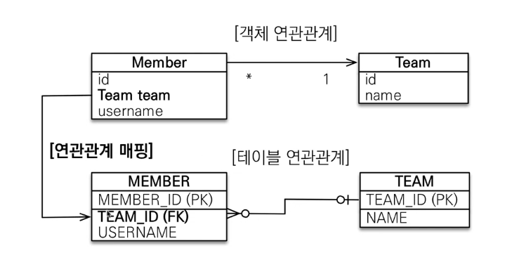
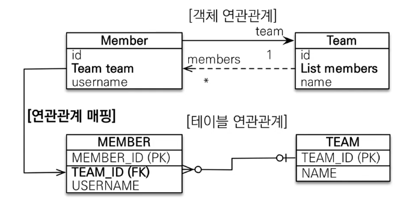

# 다대일 N:1
가장 많이 사용된다.

---

### 1. 다대일 단방향

- 가장 많이 사용
- 외래키(FK)가 있는 곳에 참조를 걸고 연관관계 매핑을 하면 그만인 상황
- DB 입장
    - Member : Team = N : 1
    - 데이터베이스 설계상 Member(N) 쪽에 외래키가 존재하는게 맞다.
    - 통상 다(`N`)쪽에 `FK`가 존재
    - Member 입장에서 `TEAM_ID` 는 TEAM을 찾아가기 위함
- 객체 입장
    - Member(N)에 Team(1) 세팅해놓고 @ManyToOne 사용하면 그만
    - Memeber 입장에서 `team`은 Team을 찾아가기 위함

<br>

```java
@Entity
public class Memeber {
    @ManyToOne 
    @JoinColumn(name = "TEAM_ID")
    private Team team;
}
```

<br>

---

### 2. 다대일 양방향

- 다대일 단방향에 `연관관계의 하인` 추가
- 다대일의 1(Team)에서 N(`List<Member>`)을 너무 조회하고 싶을 때 사용

```java
@Entity 
public class Memeber {
  @ManyToOne
  @JoinColumn(name = "TEAM_ID")
  private Team team; // 연관관계의 주인
}
@Entity
public class Team {
  @OneToMany(mappedBy = "team") // Member에 있는 변수명
  private List<Member> members = new ArrayList<>(); // 연관관계의 하인
}
```