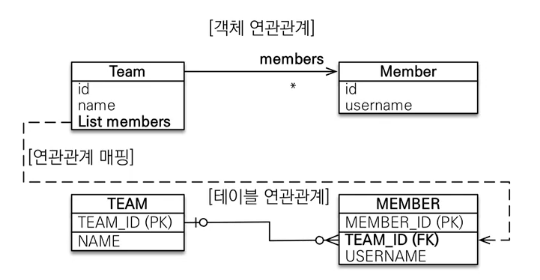
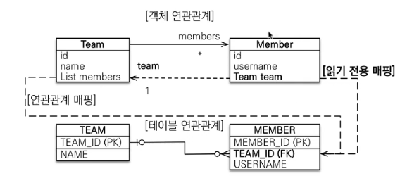

# 일대다 1:N
- `1`이 연관관계의 주인
- `1`에서 외래키를 관리하겠다.

---

### 1. 일대다 단방향

- 영한쓰가 권장하지 않는 모델 (jpa가 지원하는 스펙이기 때문에 권장 x)
- @JoinColumn을 사용하지 않으면 조인 테이블을 하나 만들어버린다.
- DB 입장 (다대일과 같다.)
    - Member : Team = N : 1
    - 데이터베이스 설계상 Member(N) 쪽에 외래키(`TEAM_ID`)가 존재
- 객체 입장
    - Team의 `members`를 중심으로 모든걸 진행하겠다.
    - Team의 `members`를 수정하였을 때 Member 테이블을 업데이트

```java
public class Team {
  @OneToMany
  @JoinColumn(name = "TEAM_ID")
  private List<Member> members = new ArrayList<>();
}
```

### 문제점
- DB의 외래키는 Member의 TEAM_ID에 있는데, 객체의 외래키 관리는 Team의 members가 한다...?
    - 엔티티가 관리하는 외래키가 다른 테이블에 있다는거 자체가 어마어마한 단점
- 연관관계 관리를 위해 추가로 UPDATE SQL 실행
    - 내 엔티티가 아닌 다른 곳에 외래키가 있으니까 옆테이블도 업데이트 쳐줘야 한다.

# `결론 - 쓰지말자`

<br>
<br>
<br>

---

### 2. 일대다 양방향

- 스펙상 되는건 아니고 야매로 되기는 한다. (주인을 또 만드는 방법)
- 둘다 주인이 돼버리면 개망한다.
    - insert, update 를 막자
    - 주인처럼 만들었지만 실상은 read only
- 뭐하러 이러냐 `다대일 양방향` 써라

```java
public class Team {
  @OneToMany
  @JoinColumn(name = "TEAM_ID")
  private List<Member> members = new ArrayList<>(); // 연관관계의 주인
}
public class Member {
  @ManyToOne
  @JoinColumn(name = "TEAM_ID", insertable = false, updatable = false)
  private Team team;    // 연관관계의 하인
}
```

# `결론 - 쓰지말자`

<br>