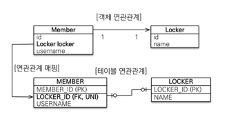
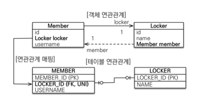
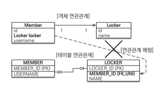
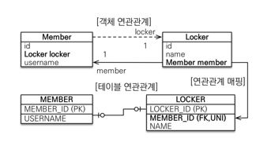

# 일대일 1:1
- 일대일은 반대로 해도 일대일
- 주 테이블과 대상 테이블 중 외래키를 선택하자.
---

### 1. 주 테이블에 외래키 + 단방향

- 다대일 단방향 매핑과 유사

<br>

```java
@Entity
class Member {
  @Id @GeneratedValue
  private Long id;

  private String userName;

  @OneToOne
  @JoinColumn(name = "LOCKER_ID")
  private Locker locker; 
}

@Entity
class Locker {
  @Id @GeneratedValue
  private Long id;

  private String name;
}
```

<br>

---

### 2. 주 테이블에 외래키 + 양방향

- 외래키가 있는 곳이 연관관계의 주인 (다대일 양방향 매핑과 동일)
- 반대편은 mappedBy 적용 (다대일 양방향 매핑과 동일)

```java
@Entity
class Member {
  @Id @GeneratedValue
  private Long id;

  @OneToOne
  @JoinColumn(name = "LOCKER_ID")
  private Locker locker;
  
  private String userName;
}

@Entity
class Locker {
  @Id @GeneratedValue
  private Long id;

  private String name;
  
  @OneToOne(mappedBy = "locker")
  private Member member;
}
```


<br>

---

### 3. 대상 테이블에 외래키 + 단방향

- JPA에서 지원하지 않는다.
- 지원도 안되고 방법도 없음

<br>

---

### 4. 대상 테이블에 외래키 + 양방향

- 주 테이블에 일대일 양방향과 매핑 방법은 동일하다.

<br>

---

### 여기서 잠깐!
- DB 설계상 Member에 locker의 외래키? vs Locker에 member의 외래키?
  - 너였으면 어떻게 설계할거니?

---

### 정리
- 주 테이블에 외래키
  - 주 객체가 대상 객체의 참조를 가지는 것 처럼 주 테이블에 외래키를 두고 대상 테이블을 찾는다.
  - 객체지향적
  - JPA 매핑이 편리하다.
  - 장점 : 주 테이블만 조회해도 대상 테이블 데이터 확인 가능
- 대상 테이블에 외래키
  - 전통적인 DB 개발자 선호
  - 장점 : 주 테이블과 대상 테이블을 1:1 => 1:N 으로 변경할 때 테이블 구조 수정이 필요없음
