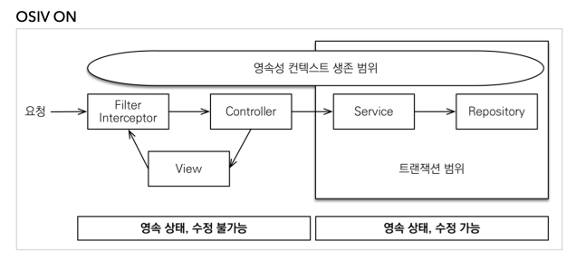
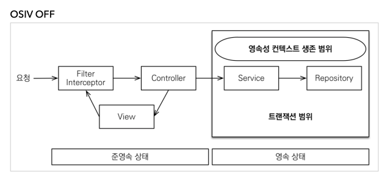

- OSIV 전략은 트랜잭션 시작처럼 최초 데이터베이스 커넥션 시작 시점부터 
  API 응답이 끝날 때 까지 영속성 컨텍스트와 데이터베이스 커넥션을 유지
- 그래서 지금까지 View Template이나 API 컨트롤러에서 지연 로딩이 가능했음
- 지연 로딩은 영속성 컨텍스트가 살아있어야 가능하고, 영속성 컨텍스트는 기본적으로 DB 커넥션을 유지

 
- BUT, 이 전략은 DB 커넥션 리소스를 오랫동안 사용하기 때문에, 실시간 트래픽이 중요한 애플리케이션에서는 커넥션이 모자랄 수 있다.
- ex) 컨트롤러에서 외부 API를 호출하면 외부 API 대기 시간 만큼 커넥션 리소스를 반환하지 못하고, 유지해야 함

   

- 트랜잭션을 종료할 때 영속성 컨텍스트를 닫고, DB 커넥션도 반환 => 커넥션 리소스 낭비 X 
- OSIV를 끄면 모든 지연로딩을 트랜잭션 안에서 처리해야 한다.
- 따라서 지금까지 작성한 많은 지연 로딩 코드를 트랜잭션 안으로 넣어야 하는 단점 존재
- view template에서 지연로딩이 동작 X
- 결론적으로 트랜잭션이 끝나기 전에 지연로딩을 강제로 호출해 두어야 한다.

## 커멘드와 쿼리를 분리하자
- OrderService
  - OrderService : 핵심 비즈니스 로직
  - OrderQueryService : 화면이나 API에 맞춘 서비스 (주로 읽기 전용 트랜잭션 사용)

- 둘의 관심사를 분리하자
  - 복잡한 화면을 출력하기 위한 쿼리는 화면에 맞추어 성능을 최적화 하는게 중요
  - 이건 복잡성에 비해 핵심 비즈니스에 큰 영향을 주지가 않는다.
  - 그래서 나누자
- 보통 서비스계층에서 트랜잭션 유지
- 두 서비스 모두 트랜잭션을 유지하면서 지연로딩 사용 O
