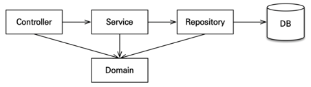

- MVC
  - controller, web: 웹 계층
  - service: 비즈니스 로직, 트랜잭션 처리
  - repository: JPA를 직접 사용하는 계층, 엔티티 매니저 사용
  - domain: 엔티티가 모여 있는 계층, 모든 계층에서 사용

- packages
  - jpabook.jpashop
    - domain
    - exception
    - repository 
    - service
    - web

### 순서 : 서비스, 리포지토리 계층을 개발하고, 테스트 케이스를 작성해서 검증, 마지막에 웹 계층 적용
