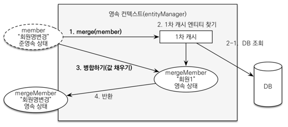

# 변경감지와 병합

## 서론

```java
//== 비즈니스 로직 ==//
/** 주문 취소 **/
fun cancel() {
  if (delivery.status == DeliveryStatus.COMP)
      throw IllegalStateException("이미 배송 완료된 상품은 취소가 불가능합니다.")

  status = OrderStatus.CANCEL
  orderItems.forEach { it.cancel() }
}
```
>- Order의 cancel()을 보면 status를 OrderStatus.CANCEL로 바꿔주고 따로 JPA에게 알려주지 않았다.
>- entity manager를 이용해 `update`, `merge` 등등을 전혀 쓰지 않았다.
>- 값을 가져와서 바꿔놓으면 트랜잭션 커밋시점에 JPA가 변경점을 찾아서 DB update문을 날리고 커밋한다.
>- 즉, `transaction commit` 시점에 dirty checking(변경감지)이 일어난다.

<br>

## 준영속 엔티티
- 영속성 컨텍스트가 더는 관리하지 않는 엔티티

```java
Book book = new Book();
book.setId(id);
book.setName(name);

itemService.save(book);
```
>- `준영속 엔티티` : 임의로 만들어낸 엔티티(비영속적) + 식별자를 가지고 있는 엔티티(영속적) 
>- 여기서는 itemService.save(book) 에서 수정을 시도하는 Book 객체
>  - Book 객체는 이미 DB에 한번 저장된 적이 있어 식별자가 존재
>  - 이렇게 임의로 만들어낸 엔티티가 기존 식별자를 가지고 있으면 준영속 엔티티이다.
><br><br>
>- 여기서 중요한 점!
>  - 준영속 엔티티의 문제는 `JPA가 관리를 하지 않는다`는 것이다.
>  - 영속 상태의 엔티티는 변경을 다 감지하고 관리해준다.(dirty checking)
>  - 준영속 엔티티는 내가 직접만든거지 JPA에서 관리해주는 놈이 아니다.
>    - 따라서 3번 째 줄까지는 update되지 않는다.(사실 당연)
>- 그럼 이 준영속 엔티티를 어떻게 수정할까?


# 준영속 엔티티를 수정하는 방법

## 1. 변경감지 기능 사용 (`dirty checking`)

```java
@Transactional
// 1. 수정되어야 할 정보가 담긴 객체(준영속 엔티티)를 파라미터로 받는다.
void update(Item newItem) { 
    // 2. 준영속 엔티티의 id로 캐시(or DB)에서 찾아온다. 여기의 findItem은 영속 엔티티
    Item findItem = em.find(Item.class, newItem.getId()); 
    
    // 3. findItem의 데이터를 수정한다.
    findItem.setPrice(newItem.getPrice()); 
     ...
}
```

>- 영속성 컨텍스트에서 엔티티를 다시 조회한 후에 데이터를 수정하는 방법
>- 트랜잭션 안에서 엔티티를 다시 조회, 변경할 값 선택 트랜잭션 커밋 시점에 변경 감지(Dirty Checking)
>  - 이게 가능한 이유는 2번과 같이 엔티티를 찾으면 그놈은 영속상태이니까 가능
>- 이 동작에서 데이터베이스에 커밋 시점에 UPDATE SQL 실행
><br><br>
>`이 방법이 더 나은 방법이다.`

<br>

## 2. 병합(`merge`)
- 1번 방법에서 내가 한땀한땀 setName, setPrice 해줬던 코드들을 한줄로 해주는 기능

```java
@Transactional
void save(Item item) {
    if(item.getId() == null) {
        em.persist(item);   
     }
    else {
        em.merge(item);
     }
}
```
>- save() 메서드는 식별자 값이 없으면(null) 새로운 엔티티로 판단해서 영속화(persist)
>- 식별자가 있으면 병합(merge)
>  - 지금처럼 준영속 상태인 상품 엔티티를 수정할 때는 id 값이 있으므로 병합 수행

<br>


>1. merge() 를 실행
>2. 파라미터로 넘어온 준영속 엔티티의 식별자 값(id)으로 1차 캐시에서 엔티티 조회
>   1. 1차 캐시에 엔티티가 없으면 데이터베이스에서 엔티티를 조회 + 1차 캐시에 저장
>3. 조회한 영속 엔티티에 준영속 엔티티의 `모든` 값을 갈아끼운다.
>4. 영속 상태인 mergeMember를 반환한다.

<br>

병합 동작 방식을 코드로 나타내면
```java
public Member updateMember(Member member) {
    Member mergeMember = em.find(Member::class, member.getId());
    
    mergeMember.setPrice(member.getAddress());
    mergeMember.setName(member.getName());
    mergeMember.setAge(member.getAge());
    return mergeMember;
}
```

```text
**주의사항**

1. 상태

여전히 member는 준영속 상태
merge(member)의 결과값(위 코드의 mergeMember)이 영속상태이다.

따라서 이후에 계속 엔티티를 쓰고싶다면 merge(member)의 결과값을 써야한다.


2. 변경 속성

1번 방식은 원하는 값만 수정할 수 있지만 merge 방식은 모든 속성이 변경된다.
따라서 병합시 값이 없으면 null로 업데이트 해버린다. (선택의 개념이 아님)
```

<br><br>

> 참고: <br>
> 실무에서는 보통 업데이트 기능이 매우 재한적이다.<br>
> 그런데 병합은 모든 필드를 변경해버리고, 데이터가 없으면 null 로 업데이트 해버린다. <br>
> 병합을 사용하면서 이 문제를 해결하려면, 변경 폼 화면에서 모든 데이터를 항상 유지해야 한다.<br> 
> 실무에서는 보통 변경가능한 데이터만 노출하기 때문에, 병합을 사용하는 것이오히려 번거롭다.


<br><br>
## 가장 좋은 해결 방법
>1. 엔티티를 변경할 때는 항상 `변경 감지`를 사용 <br>
>2. 컨트롤러에서 어설프게 엔티티를 생성 X <br>
>3. 트랜잭션이 있는 서비스 계층에 식별자( id )와 변경할 데이터를 명확하게 전달(파라미터 or dto) <br>
>4. 트랜잭션이 있는 서비스 계층에서 영속 상태의 엔티티를 조회하고, 엔티티의 데이터를 직접 변경하세요. (`merge X`) <br>


