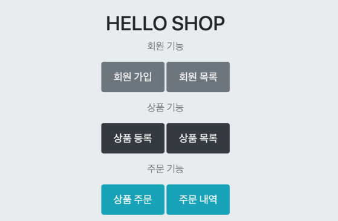
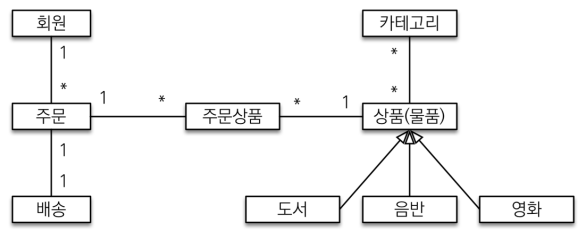
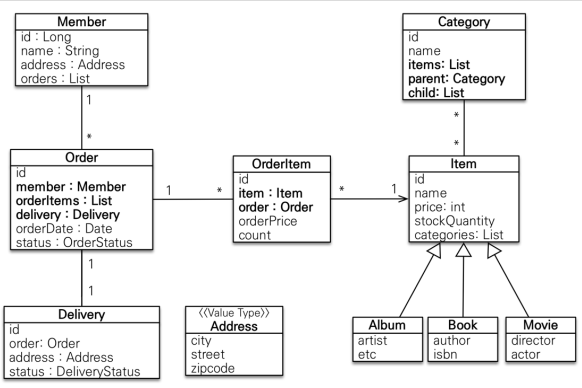
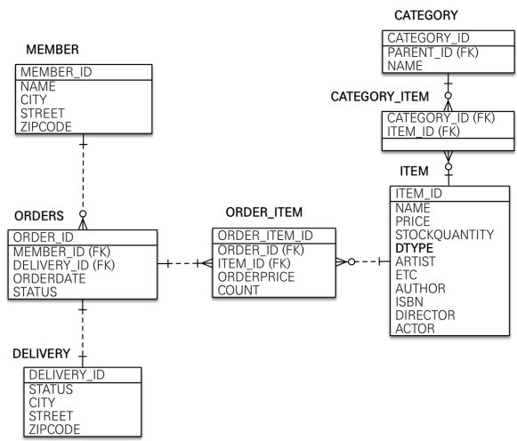

## 기능 목록

---

1. 회원
    - 회원 등록/조회
2. 상품
    - 상품 등록/수정/조회
3. 주문
   - 상품 주문
   - 주문 내역 조회
   - 주문 취소
4. 기타 요구사항
   - 상품은 재고 관리가 필요하다.
   - 상품의 종류는 도서, 음반, 영화가 있다.
   - 상품을 카테고리로 구분할 수 있다.
   - 상품 주문시 배송 정보를 입력할 수 있다.

   

## 도메인 모델 설계

---

1. 회원(1) - 주문(N)
    - 회원은 여러 주문을 할 수 있다.
2. 주문(1) - 배송(1)
   - 하나의 주문에 배송은 한번 진행된다.
3. 주문(N) - (주문 상품) - 상품(N)
   - 한 번 주문할 때 여러 상품을 주문할 수 있다.
   - 하나의 상품이 여러번 주문될 수 있다.
   - 다대다 관계는 관계형 데이터베이스는 물론이고 엔티
     티에서도 거의 사용하지 않기 때문에   일대다, 다대일로 풀어낸다.
4. 카테고리(N) - 상품(N)
   - 하나의 카테고리는 여러 상품 (O)
   - 하나의 상품이 여러 카테고리 (O)
5. 상품 - 도서/음반/영화
   - 상품이라는 공통 속성을 사용하므로 상속 구조로 표현

   

## 클래스 설계

---

1. 회원`Member`
   - 이름과 임베디드 타입인 `Address`, `orders` 리스트를 가진다.
2. 주문`Order`
   - 한 번 주문시 여러 상품을 주문할 수 있으므로 주문과 주문상품`OrderItem`은 일대다 관계
   - 주문은 상품을 주문한 회원과 배송 정보, 주문 날짜, `status`를 가진다.
   - 주문 상태는 `ORDER`, `CANCEL`를 표현할 수 있다.
3. 주문상품`OrderItem`
   - 주문한 상품 정보와 `orderPrice`, `count` 정보를 가진다.
4. 상품`Item`
   - 이름, 가격, `stockQuantity`을 가진다.
   - 상품을 주문하면 재고수량이 줄어든다.
   - 상품의 종류로는 도서, 음반, 영화가 있는데 각각은 사용하는 속성이 조금씩 다르다.
5. 배송`Delivery`
   - 주문시 하나의 배송 정보를 생성한다. 
   - 주문과 배송은 일대일 관계
6. 카테고리`Category`
   - 상품과 다대다 관계를 맺는다.
   - parent, child로 부모, 자식 카테고리를 연결
7. 주소`Address`
   - 값 타입 (임베디드 타입)
   - `Member`와 `Delivery`에서 사용

   

## 테이블 설계

---

- 엔티티
  - `MEMBER`
    - 회원 엔티티의 Address 임베디드 타입 정보가 회원 테이블에 그대로 들어갔다.
    - 이것은 DELIVERY 테이블도 마찬가지
  - `ITEM`
    - 앨범, 도서, 영화 타입을 통합해서 하나의 테이블로 만들었다.
    - DTYPE 컬럼으로 타입을 구분
  - `ORDERS`
    - 디비가 `order by` 때문에 예약어로 잡고있는 경우가 있어 관례상 `ORDERS`
- 연관관계
  - `Member` - `Orders`
    - 일대다, 다대일의 양방향 관계
    - 따라서 연관관계의 주인을 정해야 하는데, 외래 키가 있는 주문을 연관관계의 주인으로 정하는 것이 좋다. 
  - `OrderItem` - `Orders`
    - 다대일 양방향 관계 
    - 외래 키가 주문상품에 있으므로 주문상품이 연관관계의 주인이다.
  - `OrderItem` - `Item`
    - 다대일 단방향 관계
  - `Orders` - `Delivery`
    - 일대일 양방향 관계
  - `Category` - `Item`
    - @ManyToMany를 사용해서 매핑
    - 실무에서 @ManyToMany는 사용하지 말자. 여기서는 다대다 관계의 예시일뿐

  

### `외래키가 있는 곳을 연관관계의 주인으로 정하라`