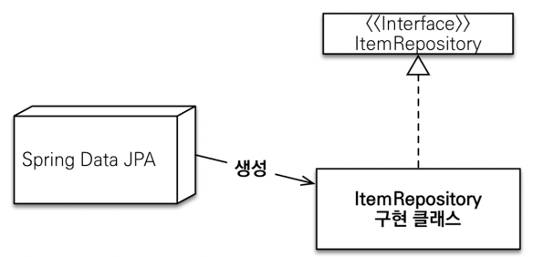
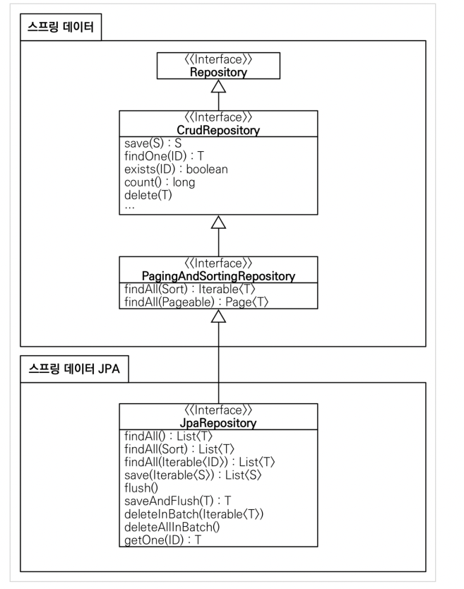

## 공통 인터페이스 설정

```java
@Configuration
@EnableJpaRepositories(basePackages = "jpabook.jpashop.repository")
public class AppConfig {}
```
- 스프링 부트를 사용하면 생략 가능
  - @SpringBootApplication 위치를 지정하는데 이때 해당 패키지와 하위 패키지를 인식
  - 하지만 위치가 달라지면 @EnableJpaRepositories 필요


- 스프링 데이터 JPA가 구현 클래스를 대신 생성한다.


- `org.springframework.data.repository.Repository`를 구현한 클래스가 스캔 대상이 된다.
  - MemberRepository가 동작한 이유가 이것임
  - 실제 MemberRepository를 출력해보면 프록시 객체가 나오는것을 볼 수 있음
- @Repository 어노테이션 생략 가능
  - 컴포넌트 스캔을 스프링 데이터 JPA가 자동으로 처리
  - JPA 예외 -> 스프링 예외 변환 기능

## 공통 인터페이스 적용
#### 순수 JPA로 구현한 `MemberJpaRepository` 대신에 스프링 데이터 JPA가 제공하는 공통 인터페이스를 사용하자

## 공통 인터페이스 분석
- JpaRepository 인터페이스는 공통 CRUD를 제공한다.


### 주의점
- `T findOne(ID)` -> `Optional<T> findById(ID)` 변경
- `boolean exists(ID)` -> `boolean existsById(ID)` 변경
- T(엔티티), ID(엔티티의 식별자), S(엔티티와 그 자식타입)
- 주요 메서드
  - save(S) : 새로운 엔티티면 저장, 이미 있으면 병합
  - delete(T) : 엔티티 하나 삭제. 내부에서 `em.remove()` 호출
  - findById(ID) : 엔티티 하나 조회. 내부에서 `em.find()` 호출
  - getOne(ID) : 엔티티를 프록시로 조회. 내부에서 `em.getReference()` 호출
  - findAll( ) : 모든 엔티티 조회. 정렬이나 페이징 조건을 파라미터로 제공할 수 있다.
